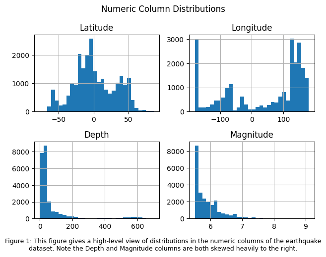
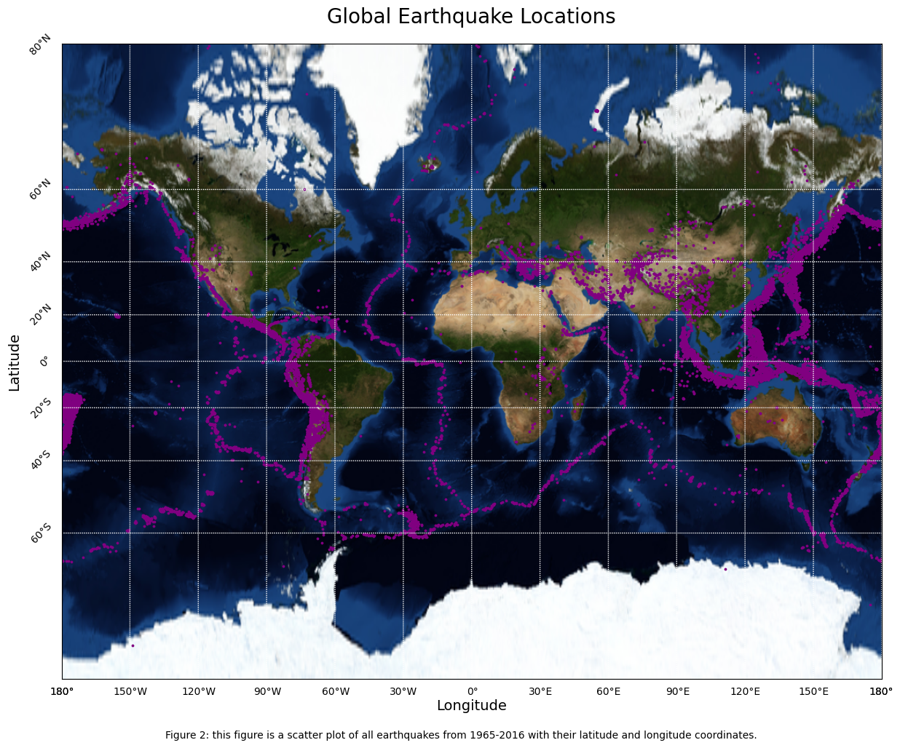
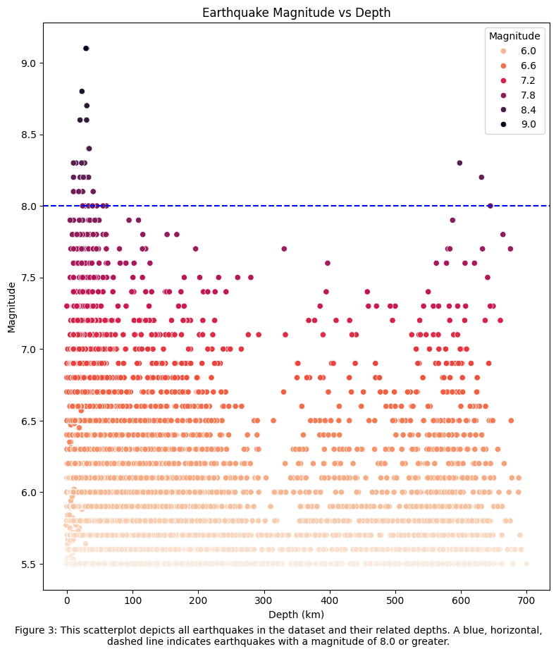
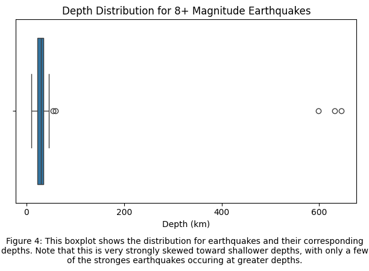
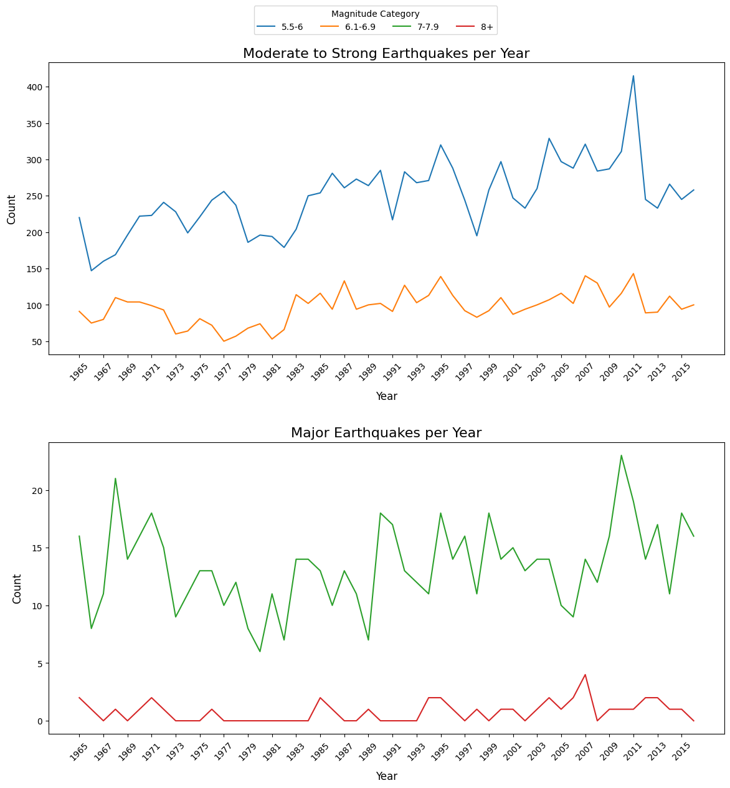
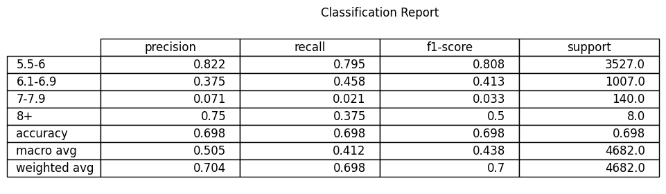
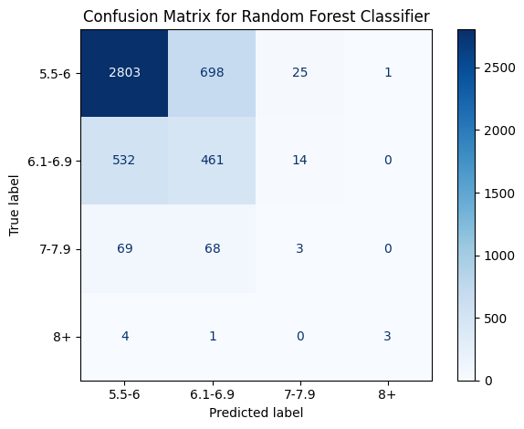

# Earthquakes from 1965-2016: Data Analysis and Machine Learning Evaluation

Author: Lex Albrandt  
Date: June 8th, 2026
Class: SYSC 410 Final Project

## Introduction

Earthquakes, or quakes, occur when there is a sudden release of energy in the lithosphere that causes shaking on the Earth's surface. These seismic events occur in varying degrees of intensity and destruction, with an estimated 500,000 occurances per year.[1] The vast majority of these earthquakes are undetectable to humans without specialized equipment. Other earthquakes are far more intense and cause massive amounts of destruction to both life and property. Earthquake predication is an active area of study due to the direct impact on millions of people worldwide.

The focus of this project uses a database of earthquake occurances from the National Earthquake Information Center[2] from 1965-2016. The recorded earthquakes a minimum magnitude of 5.5. The database was acquired through Kaggle[3]. Throughout this report we will explore the data, visualize data trends, and ultimately use machine learning principles to attempt to predict the magnitude category of earthquakes.

## Methods

The methods used for analysis of the Earthquakes Database and machine learning (ML) evaluation
follow the following pipeline:

1. Load data
2. Exploratory Data Analysis (EDA)
3. Data Cleaning
4. ML train/test data split
5. ML model training
6. Results evaluation
7. Iteration

**Note:** EDA and data cleaning steps were exchanged in this process, as there were a large number of columns with significant amounts of non-null values that were dropped prior to EDA.

### Data loading and cleaning

Python and relevant libraries were the exclusive framework used for all steps of the ML pipeline throughout this project. The original, uncleaned dataset contained $21$ feature columns and $23412$ rows. The following table shows initial value information, including rows null-value count of the uncleaned dataset.

| Column                     | Non-Null Count | Data Type |
| -------------------------- | :------------- | --------- |
| Date                       | 23412 non-null | string    |
| Time                       | 23412 non-null | string    |
| Latitude                   | 23412 non-null | float64   |
| Longitude                  | 23412 non-null | float64   |
| Type                       | 23412 non-null | string    |
| Depth                      | 23412 non-null | float64   |
| Depth Error                | 4461 non-null  | float64   |
| Depth Seismic Stations     | 7097 non-null  | float64   |
| Magnitude                  | 23412 non-null | float64   |
| Magnitude Type             | 23409 non-null | string    |
| Magnitude Error            | 327 non-null   | float64   |
| Magnitude Seismic Stations | 2564 non-null  | float64   |
| Azimuthal Gap              | 7299 non-null  | float64   |
| Horizontal Distance        | 1604 non-null  | float64   |
| Horizontal Error           | 1156 non-null  | float64   |
| Root Mean Square           | 17352 non-null | float64   |
| ID                         | 23412 non-null | string    |
| Source                     | 23412 non-null | string    |
| Location Source            | 23412 non-null | string    |
| Magnitude Source           | 23412 non-null | string    |
| Status                     | 23412 non-null | string    |

Note in the table above, there are a large number of columns that have a significant number of non-null values, meaning those values are entirely missing from the dataset, either because they were not recorded, or were omitted. Because this project is a relatively rudimentary ML exploration, columns with large amounts of non-null values, and other columns deemed irrelevant to this exploration were dropped, resulting in the following dataset:

| Column           | Non-Null Count | Data type      |
| ---------------- | -------------- | -------------- |
| Date             | 23409 non-null | datetime64[ns] |
| Time             | 23409 non-null | datetime64[ns] |
| Latitude         | 23409 non-null | float64        |
| Longitude        | 23409 non-null | float64        |
| Type             | 23409 non-null | string         |
| Depth            | 23409 non-null | float64        |
| Magnitude        | 23409 non-null | float64        |
| Magnitude Type   | 23409 non-null | string         |
| Source           | 23409 non-null | string         |
| Location Source  | 23409 non-null | string         |
| Magnitude Source | 23410 non-null | string         |
| Status           | 23409 non-null | string         |

During data cleaning the data type for Date and Time were also changed to datetime64
data type for ease of accessing data members during EDA.

### Exploratory Data Analysis (EDA)

We begin the EDA with a simple histogram of all numeric columns in the dataset to
visualize the distribution of those columns.

In addition to determining column distribution, it is useful to plot the earthquakes
in a way that allows us to see geographic locations where earthquakes cluster. In
the figure below, a scatter plot of latitudes and longitudes for all earthquakes in the
dataset was generate on top of a world map.

When comparing our scatter plot to the map of tectonic plates[4] below, it's easy to see
that the vast majority of earthquakes occur along the intersections of the tectonic
plates around the world.

.png>)

In the plot below we explore the relationship of earthquake depth to magnitude.
While most of the less intense earthquakes are distributed quite equally throughout
various depths, the stronges earthquakes (magnitude 8.0 and greater) clearly occur
at much shallower depths.

In order to get a better idea of the distribution of these strong quakes, we created
a boxplot that isolates only the strongest earthquakes.

For the last portion of the EDA, we wanted to get a look at the number of earthquakes
in various categories over all of the years in the dataset. This lineplot was split
into two separate plots: one with earthquakes of magnitudes 5.5-6, and 6.1-6.9, and
the other with earthquakes of magnitudes 7-7.9, and 8+.

The vast majority of earthquakes in this dataset are in the category with magnitudes
of 5.5-6, while magnitudes of 8+ occur with far less frequency.

### Machine Learning Pipeline

For this dataset we chose to use the Random Forest Classifier, which is a classifier
that builds a forest of individual decision trees, allowing for better generalization
on unseen data. For this ML pipeline, our target was Magnitude Category, which splits
the data into categories (as seen in the EDA section) based on their magnitudes. It
is worth noting that the classes have a heavy imbalance when it comes to the most
extreme earthquakes. While we won't be using SMOTE to correct the class imbalance in
this particular pipeline, we will discuss options for improving model metrics after
establishing a baseline.

For model preprocessing, any missing numerical values were imputed for median with the Simple Imputer from the sklearn packages, and categorical columns were
one-hot encoded because Random Forest requires numerical input. We used 200 estimators in the forest, a random state for reproducibility, and a balanced class weight. During the train/test split, we used a split of $80\%$ training and $20\%$ testing.

## Results

The results from the model training are shown in the classification report and confusion matrix below:

We can see above that the model performed moderately well on the 5.5-6 magnitude category, and fairly poorly on other classes. In particular, the F1 score for the two most dangerous and destructive categories (7-7.9 and 8+) were quite low. This is worth noting because the risk for misclassification here is quite high.

## Discussion

With more work, or a more complex model, in conjunction with methods for correcting class imbalance, we _may_ be able to acheive a better result. That said, synthetic oversampling to correct class imbalance adds a layer of complexity to this project that is beyond a somewhat introductory machine learning class. It is also worth noting that this is a fairly common problem with natural science datasets, as there are often cases where the most rare events simply do not have enough data to bring classes back into balance.

## Sources

1. Wikipedia Contributors. “Earthquake.” Wikipedia, Wikimedia Foundation, 2 Mar. 2019, en.wikipedia.org/wiki/Earthquake.
2. “National Earthquake Information Center (NEIC) | U.S. Geological Survey.” Www.usgs.gov, www.usgs.gov/programs/earthquake-hazards/national-earthquake-information-center-neic.
3. Contributors, Kaggle. “Significant Earthquakes, 1965-2016.” Www.kaggle.com, 2016, www.kaggle.com/datasets/usgs/earthquake-database.
4. Wikipedia Contributors. “List of Tectonic Plates.” Wikipedia, Wikimedia Foundation, 2 June 2019, en.wikipedia.org/wiki/List_of_tectonic_plates.
